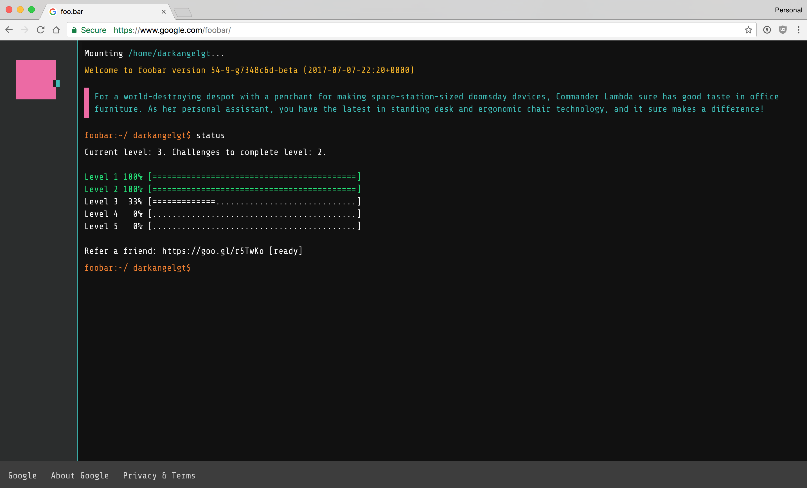

# foo.bar

This repository contains my journey through Google's "*secret*" recruitment tool **foo.bar**.

## Challenges

[Journal](challenges/journal.md)

### Level 1

- [Braille Translation](challenges/l1-braille-translation-2.md)
- [Prison Labor Dodgers](challenges/l1-prison-labor-dodgers.md)

### Level 2

- [Ion Flux Relabeling](challenges/l2-ion-flux-relabeling.md)
- [Don't Get Volunteered](challenges/l2-dont-get-volunteered.md)
- [Elevator Challenge](challenges/l2-elevator-challenge.md)
- [Power Hungry](challenges/l2-power-hungry.md)

### Level 3

- [Bomb Baby](challenges/l3-bomb-baby.md)
- [Prepare the Bunnies's Escape](challenges/l3-prepare-the-bunnies-escape.md)
- [The Grandest Staircase Of Them All](challenges/l3-the-grandest-staircase-of-them-all.md)
- [Fuel Injection Perfection](challenges/l3-fuel-injection-perfection.md)

## Solutions

Switch to the `solutions/` directory and run the unit tests by issuing the following command from the command line:

    make test
